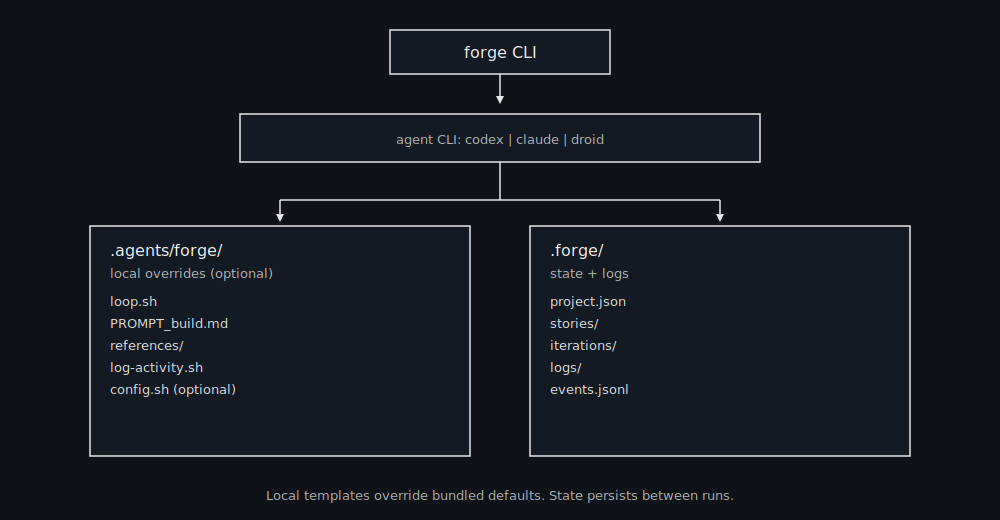

# BrainDrive Forge


BrainDrive Forge is a production-grade, file-based agent loop for autonomous coding. Each iteration starts fresh, reads the same on-disk state, emits structured events, and completes exactly one story at a time.

## How it works

Forge treats **files and git** as memory, not the model context:

- **PRD (JSON)** defines stories, gates, and status
- **Loop** executes one story per iteration
- **State** persists in `.forge/`
- **Events** are written to `.forge/events.jsonl`



## Global CLI (recommended)

Install and run Forge from anywhere:

```bash
npm i -g braindrive-forge
braindrive-forge prd # launches an interactive prompt
braindrive-forge run 1 # one Forge run
```

### Template hierarchy

Forge will look for templates in this order:

1. `.agents/forge/` in the current project (if present)
2. Bundled defaults shipped with this repo

State and logs always go to `.forge/` in the project.

### Install templates into a project (optional overrides)

```bash
braindrive-forge install
```

This creates `.agents/forge/` in the current repo so you can customize prompts and loop behavior. During install, you’ll be asked if you want to add the required skills.

### Install required skills (optional)

```bash
braindrive-forge install --skills
```

You’ll be prompted for agent (codex/claude/droid/opencode) and local vs global install. Skills installed: **commit**, **dev-browser**, **prd**.
If you skipped skills during `braindrive-forge install`, you can run `braindrive-forge install --skills` anytime.

## Quick start (project)

1) Create your PRD (JSON) or generate one:
```
braindrive-forge prd
```
Requires the **prd** skill (install via `braindrive-forge install --skills`).

Use a markdown/text file instead of an interactive prompt:
```
braindrive-forge prd --prompt ./spec.md
```

Example prompt text:
```
A lightweight uptime monitor (Hono app), deployed on Cloudflare, with email alerts via AWS SES
```

Default output (agent chooses a short filename in `.agents/tasks/`):
```
.agents/tasks/prd-<short>.json
```

2) Run one build iteration:
```
braindrive-forge run 1 # one Forge run
```

No-commit dry run:
```
braindrive-forge run 1 --no-commit # one Forge run
```

Override PRD output for `braindrive-forge prd`:
```
braindrive-forge prd --out .agents/tasks/prd-api.json
```
Optional human overview (generated from JSON):
```
braindrive-forge overview
```
This writes a tiny overview alongside the PRD: `prd-<slug>.overview.md`.

PRD story status fields are updated automatically by the loop:
- `open` → selectable
- `in_progress` → locked by a running loop (with `startedAt`)
- `done` → completed (with `completedAt`)

If a loop crashes and a story stays `in_progress`, you can set `STALE_SECONDS` in `.agents/forge/config.sh` to allow Forge to automatically reopen stalled stories.

## Pause, resume, inspect, replay

```bash
braindrive-forge pause "Taking a break"
braindrive-forge resume
braindrive-forge inspect STORY-07
braindrive-forge replay iter-12
```

## Override PRD paths

You can point Forge at a different PRD JSON file via CLI flags:

```bash
braindrive-forge run 1 --prd .agents/tasks/prd-api.json # one Forge run
```

Optional progress override:

```bash
braindrive-forge run 1 --progress .forge/progress-api.md # one Forge run
```

If multiple PRD JSON files exist in `.agents/tasks/` and you omit `--prd`, Forge will prompt you to choose.

Optional config file (if you installed templates):

```
.agents/forge/config.sh
```

## Choose the agent runner

Set `AGENT_CMD` in `.agents/forge/config.sh` to switch agents:

```
AGENT_CMD="codex exec --yolo -"
AGENT_CMD="claude -p --dangerously-skip-permissions \"\$(cat {prompt})\""
AGENT_CMD="droid exec --skip-permissions-unsafe -f {prompt}"
AGENT_CMD="opencode run \"$(cat {prompt})\""
```

Or override per run:

```
braindrive-forge prd --agent=codex
braindrive-forge run 1 --agent=codex # one Forge run
braindrive-forge run 1 --agent=claude # one Forge run
braindrive-forge run 1 --agent=droid # one Forge run
braindrive-forge run 1 --agent=opencode # one Forge run
```

If the CLI isn’t installed, Forge prints install hints:

```
codex    -> npm i -g @openai/codex
claude   -> curl -fsSL https://claude.ai/install.sh | bash
droid    -> curl -fsSL https://app.factory.ai/cli | sh
opencode -> curl -fsSL https://opencode.ai/install.sh | bash
```

## State files (.forge/)

- `project.json` — high-level project snapshot
- `stories/` — one JSON file per story
- `iterations/` — per-iteration metadata JSON
- `logs/` — raw agent output per iteration
- `events.jsonl` — structured event log
- `progress.md` — append-only progress log
- `guardrails.md` — “Signs” (lessons learned)
- `activity.log` — activity + timing log
- `errors.log` — repeated failures and notes

## Notes

- `.agents/forge` is portable and can be copied between repos.
- `.forge` is per-project state.
- Use `{prompt}` in `AGENT_CMD` when agent needs a file path instead of stdin.
- Examples: see `examples/commands.md`.
- **OpenCode server mode**: For faster performance with OpenCode, run `opencode serve` in a separate terminal and uncomment the `AGENT_OPENCODE_CMD` lines in `.agents/forge/agents.sh` to use `--attach http://localhost:4096`. This avoids cold boot on every run.

## Tests

Dry-run smoke tests (no agent required):

```bash
npm test
```

Fast agent health check (real agent call, minimal output):

```bash
npm run test:ping
```

Optional integration test (requires agents installed):

```bash
FORGE_INTEGRATION=1 npm test
```

Full real-agent loop test:

```bash
npm run test:real
```

## Credits

Inspired by Ralph: https://github.com/iannuttall/ralph
